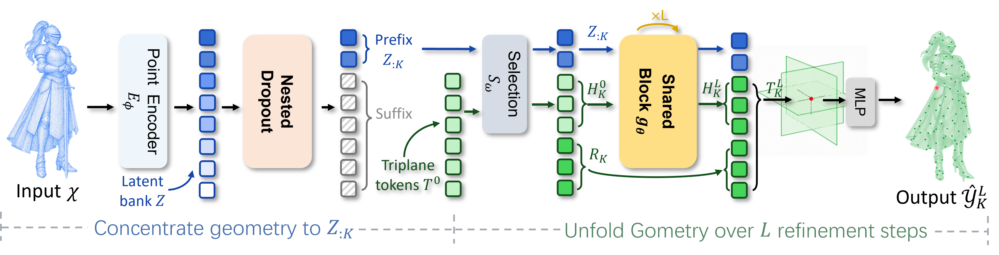

<p align="center">
  <h1 align="center">ZipTok3D: High-Fidelity 3D Tokenization with Compact Token Prefixes</h1>
  <p align="center">
    <a href="https://github.com/forthloth">Mingda Lin<sup>†</sup></a>
    ·
    <a href="https://lhmd.top">Weijie Wang<sup>†,*</sup></a>
    ·
    <a href="https://steve-zeyu-zhang.github.io">Zeyu Zhang</a>
    ·
    <a href="https://alexandertsui.github.io/">Bowen Cui</a>
    ·
    <a href="https://hexy.tech/">Yefei He</a>
    ·
    <a href="https://zhao-haoyu.github.io/">Haoyu Zhao</a>
    ·
    <a href="https://github.com/Yuanyu0">Yuanyu He</a>
    ·
    <a href="https://donydchen.github.io">Donny Y. Chen</a>
    ·
    <a href="https://chenfeng1271.github.io/">Feng Chen<sup>*</sup></a>
    ·
    <a href="https://bohanzhuang.github.io">Bohan Zhuang</a>
  </p>
  <h3 align="center">
    <a href="https://arxiv.org/pdf/2609.01740">Paper</a>
    |
    <a href="https://forthloth.github.io/ziptok3d/">Project Page</a>
    |
    <a href="https://github.com/ziplab/ZipTok3D">Code</a>
  </h3>
</p>

<p align="center">
  <a href="https://forthloth.github.io/ziptok3d/">
    
  </a>
</p>

This repository contains the training, preprocessing, reconstruction, generation,
and evaluation code for **ZipTok3D**. Datasets and trained checkpoints are not
included.

## Install

The released environment uses Python 3.9, PyTorch 2.1.0, and CUDA. From the
repository root:

```bash
conda create -n ziptok3d python=3.9 -y
conda activate ziptok3d
python -m pip install -r requirements.txt
```

Training, reconstruction, and generation evaluation also require the external
CUDA operators from `pointops`:

```bash
git clone https://github.com/Silverster98/pointops.git ../pointops
python -m pip install -v ../pointops
```

`pointops` is intentionally not redistributed here. Weights & Biases logging is
disabled by default; install the optional extra only when needed:

```bash
python -m pip install -r requirements-wandb.txt
```

## Layout

```text
cod/                         ZipTok3D models, data, losses, and solvers
config/                      Training, evaluation, and ablation configs
engine/                      Configuration and Lightning utilities
external/                    3DShape2VecSet and 3DILG source snapshots
tools/trellis500k_preprocess.py
                             TRELLIS preprocessing and split tools
train_ae.py                  Stage-1 and Stage-2 training entry point
evaluate_ae.py               Reconstruction metrics
evaluate_prefix_grid.py      Prefix/refinement sweep
generate_stage2.py           Class-conditioned mesh generation
evaluate_generation.py       Generation distribution metrics
```

The two baseline snapshots keep their original instructions and dependencies
under `external/`. See [THIRD_PARTY.md](THIRD_PARTY.md) for licenses and
upstream links.

## Data preparation

### ShapeNet

Place the 55-category ShapeNetCore-v2 records in the layout expected by
3DShape2VecSet:

```text
datasets/shapenet_vecset/
  ShapeNetV2_point/<synset>/{train,val,test}.lst
  ShapeNetV2_point/<synset>/<object>.npz
  ShapeNetV2_point/<synset>/<object>.npy
  ShapeNetV2_surface/<synset>/4_pointcloud/<object>.npz
```

Convert them to the HDF5 layout used by ZipTok3D:

```bash
python preprocess_dataset.py --data shapenet
```

### TRELLIS-500K

The `all` command (also available as `prepare`) runs metadata normalization,
asset processing, deterministic splitting, and HDF5 packing in one resumable
single-rank run. Repeat
`--metadata` and `--asset-root` for each available source:

```bash
python tools/trellis500k_preprocess.py all \
  --metadata objaverse_xl_sketchfab=<metadata.csv> \
  --metadata objaverse_xl_github=<metadata.csv> \
  --metadata abo=<metadata.csv> \
  --metadata 3d_future=<metadata.csv> \
  --metadata hssd=<metadata.csv> \
  --asset-root objaverse_xl_sketchfab=<downloaded-assets> \
  --asset-root objaverse_xl_github=<downloaded-assets> \
  --asset-root abo=<downloaded-assets> \
  --asset-root 3d_future=<downloaded-assets> \
  --asset-root hssd=<downloaded-assets> \
  --work-dir datasets/trellis500k/work \
  --packed-dir datasets/trellis500k/packed \
  --test-identifiers assets/trellis_eval_split_manifest.csv
```

The original `manifest`, `process`, `split`, and `pack` subcommands remain
available when processing ranks independently or restarting one stage. Use
those commands after all ranks finish when running distributed preprocessing.
Blender is optional for mesh formats that `trimesh` cannot read; pass its
executable with `--blender`.

## Train and evaluate

Train the tokenizer on either dataset:

```bash
python train_ae.py config/train_ziptok3d_shapenet.yaml \
  --name ziptok3d_shapenet --gpus 0,1,2,3
python train_ae.py config/train_ziptok3d_trellis.yaml \
  --name ziptok3d_trellis --gpus 0,1,2,3
```

Evaluate a reconstruction operating point. The configured evaluation split is
used when `--split` is omitted:

```bash
python evaluate_ae.py logs/ziptok3d_shapenet \
  --tokens 2 --loops 5 --gpus '[0]'
```

For the complete prefix/refinement sweep:

```bash
python evaluate_prefix_grid.py \
  logs/ziptok3d_shapenet/config.yaml <stage1-checkpoint.ckpt> \
  --tokens 1,2,4,8,16,32,64,128 --loops 1,2,3,4,5,6 \
  --metrics all --output results/shapenet_prefix_refinement.csv
```

Stage-2 training, generation, and metric evaluation use the supplied
`config/train_stage2_*.yaml` files:

```bash
python train_ae.py config/train_stage2_prefix_k16_d32.yaml \
  --name ziptok3d_prefix_vae --gpus 0,1,2,3 \
  --set solver.autoencoder_checkpoint_path=<stage1-checkpoint.ckpt>

python cache_latents.py \
  logs/ziptok3d_prefix_vae/config.yaml <prefix-vae-checkpoint.ckpt> \
  <latent-cache> --tokens 16

python train_ae.py config/train_stage2_generation.yaml \
  --name ziptok3d_edm_k16_causal --gpus 0,1,2,3 \
  --set data.cache_dir=<latent-cache> \
  --set solver.normalizer_path=<normalizer.npz>

python generate_stage2.py \
  <generation-config> <edm-checkpoint> <vae-config> <vae-checkpoint> \
  generated/ziptok3d_k2 --category 0 --num-samples 2000 \
  --tokens 2 --loops 5

python evaluate_generation.py generated/ziptok3d_k2 \
  --categories airplane,car,chair,table,rifle
```

## Checks

Before sharing a release, run:

```bash
python tools/validate_release.py
python -m unittest discover -s tests
```

The audit rejects model/data artifacts, private absolute paths, unresolved
configuration references, and an incomplete TRELLIS evaluation manifest.

## Citation

If you find ZipTok3D useful, please consider citing:

```bibtex
@misc{lin2026ziptok3d,
  title        = {ZipTok3D: High-Fidelity 3D Tokenization with Compact Token Prefixes},
  author       = {Lin, Mingda and Wang, Weijie and Zhang, Zeyu and
                  Cui, Bowen and He, Yefei and Zhao, Haoyu and He, Yuanyu and
                  Chen, Donny Y. and Chen, Feng and Zhuang, Bohan},
  year         = {2026},
  howpublished = {Technical report},
  url          = {https://forthloth.github.io/ziptok3d/}
}
```

## Contact

Please use the [issue tracker](https://github.com/ziplab/ZipTok3D/issues) for
questions, bug reports, or reproduction issues.

## Acknowledgements

This project builds on public 3D shape-tokenization and neural-field
implementations, including COD-VAE and TRELLIS-500K. The repository also
includes 3DShape2VecSet and 3DILG source snapshots for comparison. We thank
the authors for making their work available.

## License

This repository is intended for academic research and evaluation. The
third-party components under `external/` retain their original licenses; see
[`THIRD_PARTY.md`](THIRD_PARTY.md) and the corresponding `LICENSE` files.
`pointops` is an external dependency and is not redistributed here.

